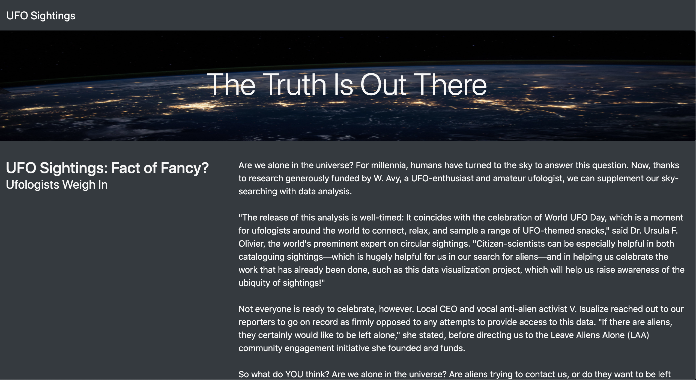
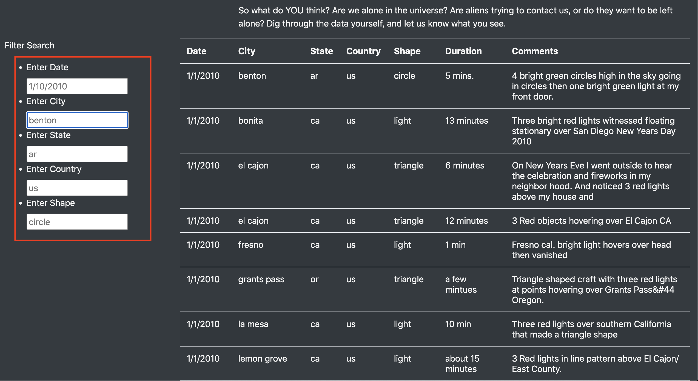
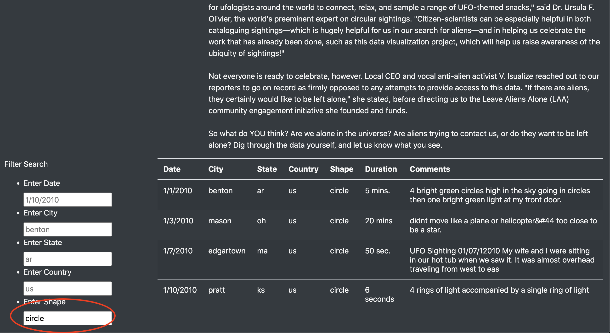
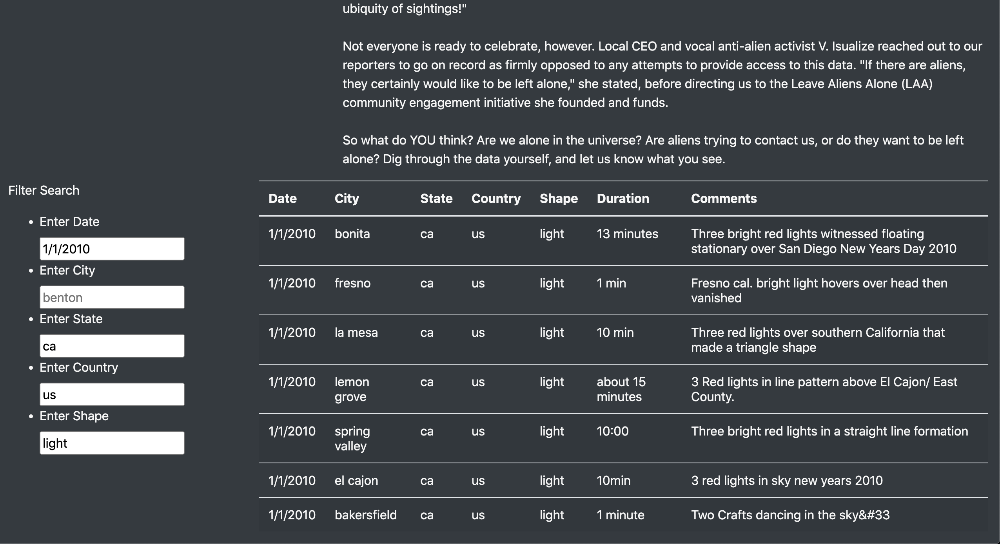

# Table of Contents

1.  [UFO JS](#org233d8dd)
    1.  [Overview](#org0d8c997)
    2.  [Results](#orgb66930c)
    3.  [Summary](#org0da2842)
    4.  [Closing Thoughts](#org132dec2)

# UFO JS

[The Truth is Out There!](https://albertov5.github.io/tec-data-11-javascript/)

## Overview

In this project we had the mission to present data in an accessible and dynamic way. We had a few parameters to use for filtering, and even though the filters are simple, we get the information we want at the press of a key.

We managed to provide a fully functional HTML website with dynamic elements powered by Javacript and the best part is that we get to host it in GitHub and share it with clients and colleagues.

## Results

We have a webpage with information at the top which gives us an introduction to the kind of data we are dealing with.

If we scroll down, we will find a table will all the available data. Note that we have filters in the left side as highlighted with the red rectangle.

We can filter the table on the right by entering text in the fields on the left. For example, we can look for all UFO with the `shape` of `circle`

Furthermore, we can make more complex searches by using the other fields. For example, if we wanted all sightings on `1/1/2010` in the `state` of `ca` with the `shape` of `light`, then we can do a query like the following:

We&rsquo;ve managed to present a clear table in a compelling way without requesting a single piece of code from the user (for example no SQL or Python syntax for filtering, just typing!).

## Summary

The mission was accomplished but it&rsquo;s always good to take a step back before moving forward with more project.

There were a few issues with the website that made it not so profesional:

1.  The most crucial issue is the way we filter the data and how the code reacts immediatly on user input. We could add more information about what type of values are best for the fields. For example, a list of possible shapes could be useful, as well as possible state names.
2.  The reaction from the table is instantaneous which is not very user friendly as the bottom part of the layout moves too much when the values change.

We could improve the overall experience by adding a few more steps to our Javascript code. We could bring back the button or use a `dropdown` menu for the available shapes, cities or even date ranges.

We could also improve the CSS by making the `div` surrounding the `table` of fixed size and then just have a scroll bar using `overflow: auto` in case we get too many results. This would help with the sudden changes in layout.

## Closing Thoughts

At the end of the day we succeeded on bringing together many pieces from different tools that we learned to use just recently. I am certain we can improve our design and interactivity skills in the near future as well as continuing using powerful JS libraries to provide even better user experience.

